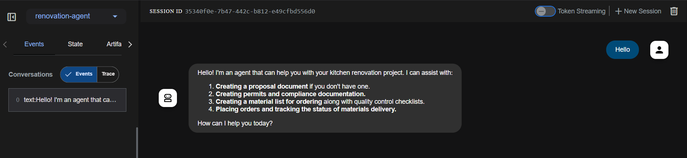
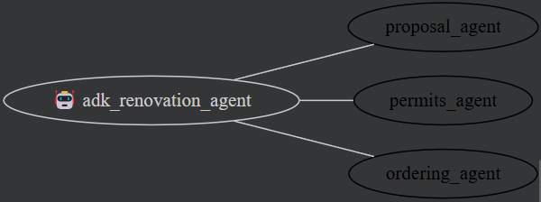
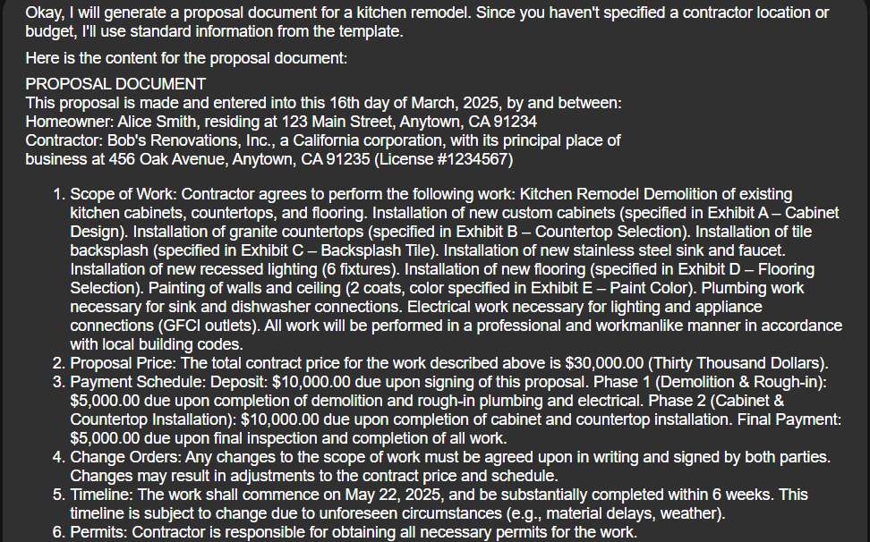

# ✅ Solution: Multi-Agent Kitchen Renovation using Vertex AI ADK

This solution explains the implementation of a modular multi-agent system using Vertex AI Agent Development Kit (ADK) to automate kitchen renovation planning. The code and assets referenced are available in the [official GitHub repo](https://github.com/AkshayCu-Codes/code-vipassana-season-10/tree/main/02-multi-agent-renovation).

---

## 🧩 Architecture Overview

### Agents Used:

* **RootAgent** – Orchestrates all tasks and aggregates results.
* **RenovationProposalAgent** – Generates a renovation plan using Gemini prompts.
* **PermitsAndComplianceAgent** – Validates zoning laws, codes, and required permits.
* **OrderStatusCheckAgent** *(optional)* – Queries a Cloud Run API to retrieve real-time material order status from AlloyDB.

All agents are defined in `agent.py` and instantiated using ADK’s orchestration logic.

---

## 🔨 Implementation Details

### Project Initialization

1. Clone the repository:

   ```bash
   git clone https://github.com/AkshayCu-Codes/code-vipassana-season-10.git
   cd code-vipassana-season-10/02-multi-agent-renovation
   ```
2. Activate Python environment:

   ```bash
   python -m venv .venv
   source .venv/bin/activate
   pip install -r requirements.txt
   ```
3. Update your `.env` with the correct values for your GCP project and endpoints.

---

## 🔁 Agent Logic Overview

### RootAgent

* Accepts structured or unstructured renovation queries.
* Delegates tasks to sub-agents via method calls.
* Aggregates responses into a unified result.
* Saves result to PDF and uploads to GCS.

### RenovationProposalAgent

* Prompts Gemini for layout and aesthetic suggestions.
* Logic and prompt design in `agent.py > RenovationProposalAgent`.

### PermitsAndComplianceAgent

* Uses hardcoded checks or Gemini queries to assess local compliance.
* Handles zoning issues, electrical clearances, etc.

### OrderStatusCheckAgent *(Optional)*

* Sends an HTTP request to `/check-order-status` Cloud Run endpoint.
* Uses the provided `material` name in the request payload.
* Parses and returns JSON response with order status.

---

## 📄 PDF & GCS Upload

* `agent.py` includes logic to:

  * Format agent output into a readable PDF.
  * Save the PDF file to the `next-demo-store` Cloud Storage bucket.
  * The PDF URL is returned in the final response.

---

## 🧪 Test Example

Use the web UI or CLI with this request:

```text
Generate a renovation plan for a 10x10 kitchen. Ensure permit compliance in California. Also check status of flooring tiles.
```

Expected Output:

* Design plan with materials, styles, and layout.
* Summary of necessary permits.
* Current shipping or delivery status of "flooring tiles".
* Final PDF with consolidated results.

---

🖼️ Results & Screenshots

### 🔹 UI Agent Welcome Message  


This welcome screen confirms successful deployment. The agent states its capabilities clearly, including proposal generation, permit verification, and material tracking.  

### 🔹 Flow Chart


The flow chart explains how the agents are called and shows the system design.  


### 🔹Output from the prompt  


---

For the complete codebase and agents, visit the GitHub repository:
[github.com/AkshayCu-Codes/code-vipassana-season-10](https://github.com/AkshayCu-Codes/code-vipassana-season-10/tree/main/02-multi-agent-renovation)
